<picture>
  <source media="(prefers-reduced-motion: reduce) and (max-width: 760px) and (prefers-color-scheme: dark)" srcset="assets/signal-banner-mobile-dark-still.svg">
  <source media="(prefers-reduced-motion: reduce) and (max-width: 760px)" srcset="assets/signal-banner-mobile-light-still.svg">
  <source media="(prefers-reduced-motion: reduce) and (prefers-color-scheme: dark)" srcset="assets/signal-banner-dark-still.svg">
  <source media="(prefers-reduced-motion: reduce)" srcset="assets/signal-banner-light-still.svg">
  <source media="(max-width: 760px) and (prefers-color-scheme: dark)" srcset="assets/signal-banner-mobile-dark.svg">
  <source media="(max-width: 760px)" srcset="assets/signal-banner-mobile-light.svg">
  <source media="(prefers-color-scheme: dark)" srcset="assets/signal-banner-dark.svg">
  
</picture>

I’m a **B.S. Computer Science student at William Paterson University**, with expected graduation in **May 2027**. I troubleshoot campus connectivity and design, configure, and verify networks in EVE-NG.

[Explore my lab ↗](https://github.com/jsambruce/ospf-multiarea-lab) · [Connect on LinkedIn ↗](https://linkedin.com/in/jsambruce)

## ⌁ A little context

```text
jsb@lab:~$ cat purpose.txt

I want to help organizations keep services available,
protect connectivity, and make networks more resilient.

Next chapter → Python development and network automation.
```

## ▣ Inside the lab

<table width="100%">
<tr>
<td>
<p><sub><strong>FEATURED PROJECT</strong> · EVE-NG LAB</sub></p>
<h3><a href="https://github.com/jsambruce/ospf-multiarea-lab">Multi-area OSPF &amp; route redistribution ↗</a></h3>
<p>Connecting network areas, exchanging routes, and checking what the routers actually learned.</p>
<p><code>OSPF</code> <code>EIGRP</code> <code>Cisco IOS</code> <code>EVE-NG</code></p>
<hr>
<p><strong>Evidence:</strong> Saved outputs show <strong>FULL neighbor adjacencies</strong> and learned inter-area and external routes.</p>
<p><a href="https://github.com/jsambruce/ospf-multiarea-lab/blob/main/images/Topology/topology.png">Topology</a> · <a href="https://github.com/jsambruce/ospf-multiarea-lab/tree/main/configs">Configurations</a> · <a href="https://github.com/jsambruce/ospf-multiarea-lab/tree/main/outputs">Verification outputs</a></p>
</td>
</tr>
</table>

## ◇ Experience, with context

<table width="100%">
<tr>
<td width="50%" valign="top">
<p><sub><strong>ON CAMPUS</strong></sub></p>
<h3>Working with real users</h3>
<p>Connectivity troubleshooting, VLANs, Cisco switch-port configuration and verification, and shadowing network engineers.</p>
</td>
<td width="50%" valign="top">
<p><sub><strong>IN EVE-NG</strong></sub></p>
<h3>Designing and validating networks</h3>
<p>Routing, switching, redundancy, network services, security controls, and failover practice in lab environments.</p>
</td>
</tr>
</table>

## ◈ My networking toolkit

Lab practice and study

| Area | Technologies and practice |
| :--- | :--- |
| **Routing & switching** | OSPF · EIGRP · BGP · redistribution · summarization · VLANs · 802.1Q · STP/RSTP · EtherChannel/LACP · inter-VLAN routing |
| **Availability & services** | HSRP · VRRP · redundant switching · failover testing · DHCP / relay · DNS · NAT / PAT |
| **Security & visibility** | ACLs · port security · DHCP snooping · Dynamic ARP Inspection · Palo Alto firewall labs · SNMP · Syslog · SolarWinds exposure |

## ↗ The next hop

<table width="100%">
<tr>
<td width="33%" valign="top">
<p><sub><strong>CERTIFIED</strong></sub></p>
<h3>CCNA</h3>
<p>Cisco networking</p>
</td>
<td width="33%" valign="top">
<p><sub><strong>LEARNING</strong></sub></p>
<h3>Python</h3>
<p>Expanding my toolkit</p>
</td>
<td width="34%" valign="top">
<p><sub><strong>ON THE HORIZON</strong></sub></p>
<h3>Ansible</h3>
<p>Network automation</p>
</td>
</tr>
</table>

---

Interested in early-career roles in **network engineering, operations, and security.**

*Build with intent. Verify with evidence.*

[More of my work ↗](https://github.com/jsambruce?tab=repositories)
