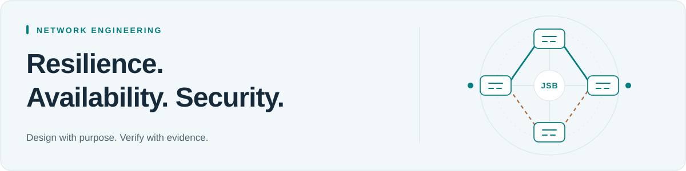

<picture>
  <source media="(max-width: 600px) and (prefers-color-scheme: dark)" srcset="assets/network-banner-mobile-dark.svg">
  <source media="(max-width: 600px) and (prefers-color-scheme: light)" srcset="assets/network-banner-mobile-light.svg">
  <source media="(prefers-color-scheme: dark)" srcset="assets/network-banner-dark.svg">
  <source media="(prefers-color-scheme: light)" srcset="assets/network-banner-light.svg">
  
</picture>

# John Sam-Bruce

**CCNA certified · Network engineering · Network operations & security**

B.S. Computer Science, William Paterson University · Expected May 2027

I build and troubleshoot networks in EVE-NG and gain practical experience supporting campus connectivity. My goal is to help organizations build resilient, secure networks that keep services available and people connected.

[Featured lab](#featured-lab) · [Campus experience](#campus-experience) · [Technical practice](#technical-practice) · [GitHub](https://github.com/jsambruce)

## Featured lab

### [Multi-area OSPF & route redistribution](https://github.com/jsambruce/ospf-multiarea-lab)

`EVE-NG` `Cisco IOS` `OSPF` `EIGRP`

A routing lab exploring how separate network areas connect to the backbone and exchange routes across routing protocols.

- **Design:** OSPF areas 0, 1, 2, and 60, with an EIGRP domain connected through R4.
- **Configuration:** a virtual link through area 1, a totally stubby area, OSPF–EIGRP redistribution, and route summarization settings.
- **Verification:** saved outputs show FULL OSPF neighbor adjacencies and learned inter-area and external routes.

**Explore the evidence:** [Topology](https://github.com/jsambruce/ospf-multiarea-lab/blob/main/images/Topology/topology.png) · [Configurations](https://github.com/jsambruce/ospf-multiarea-lab/tree/main/configs) · [Verification outputs](https://github.com/jsambruce/ospf-multiarea-lab/tree/main/outputs)

## Campus experience

At William Paterson University, my practical networking experience includes:

- Troubleshooting user connectivity and working with VLANs.
- Configuring and verifying switch ports using Cisco CLI.
- Shadowing network engineers to learn how campus networks are operated and maintained.

## Technical practice

The technologies below reflect my lab practice and study. My campus responsibilities are described above.

| Area | Technologies and practice |
| :--- | :--- |
| **Routing** | OSPF, EIGRP, BGP, redistribution, route summarization |
| **Switching** | VLANs, 802.1Q trunks, STP/RSTP, EtherChannel/LACP, inter-VLAN routing |
| **Network services** | DHCP, DHCP relay, DNS, NAT, PAT |
| **Resilience** | VRRP, HSRP, redundant switching, failover testing |
| **Security** | ACLs, port security, DHCP snooping, Dynamic ARP Inspection, Palo Alto firewall labs |
| **Monitoring** | SNMP, Syslog; exposure to SolarWinds |

## What I’m developing next

- Deeper practice with campus redundancy, failure scenarios, and recovery verification.
- Stronger documentation connecting topology, configuration choices, and troubleshooting evidence.
- Python fundamentals as a foundation for network automation, with Ansible as a future learning goal.

I’m interested in early-career opportunities in network engineering, network operations, and network security.

[Browse my repositories →](https://github.com/jsambruce?tab=repositories)

<!-- Optional: add a confirmed public LinkedIn URL and/or portfolio link here. -->
